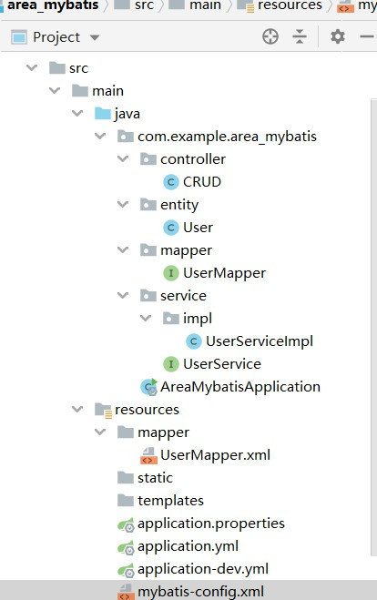
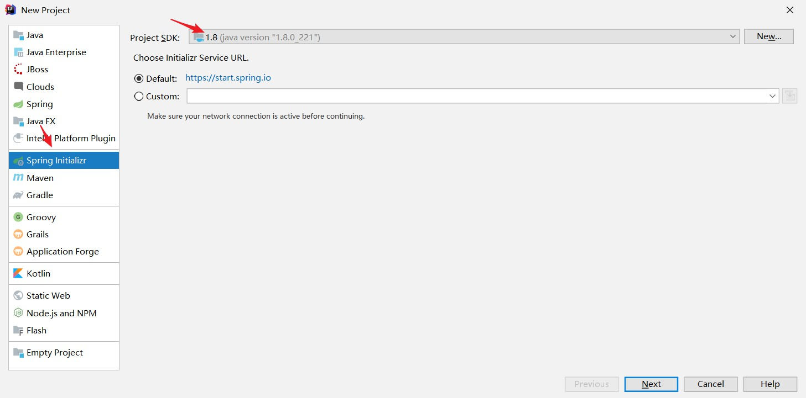
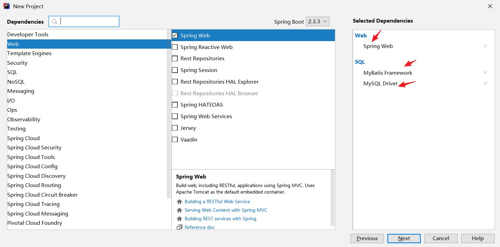
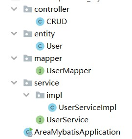
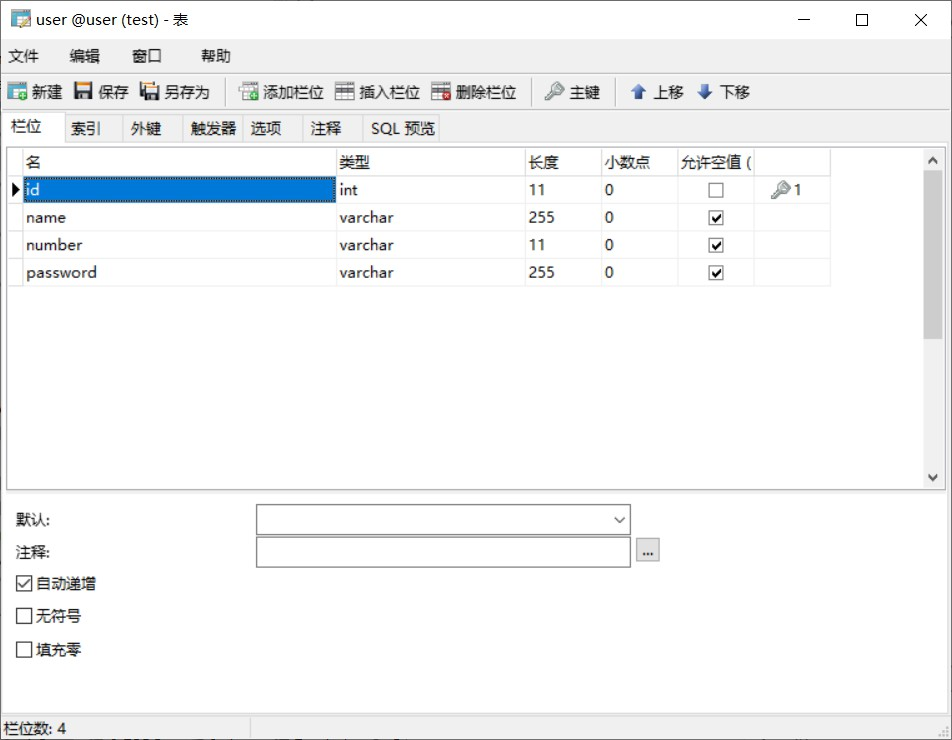
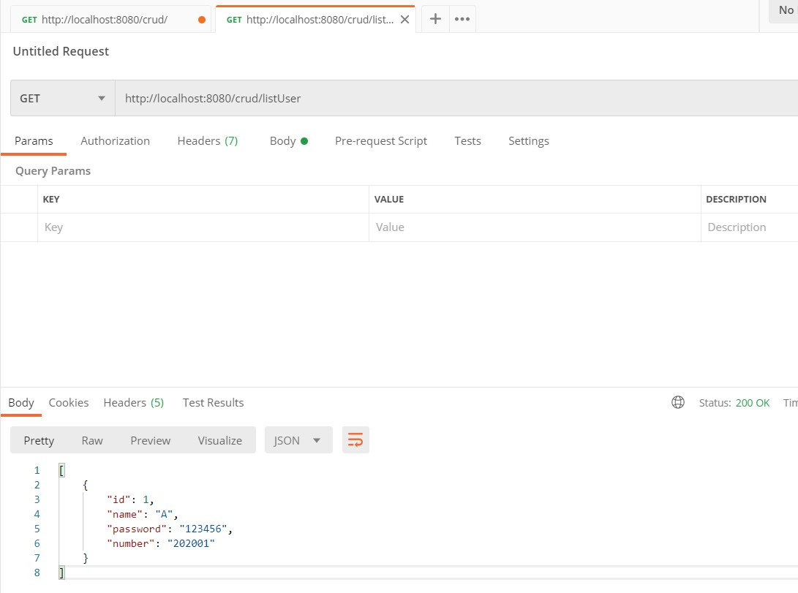
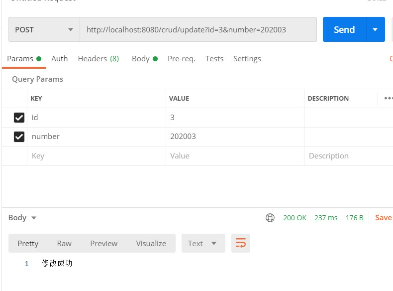
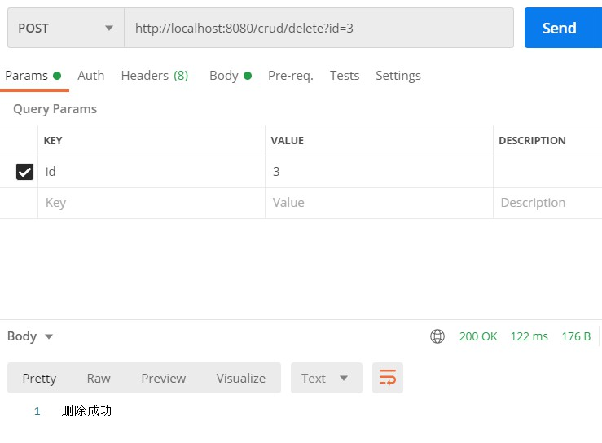

# 【开发篇】10分钟快速上手spring boot+mybatis增删改查

本次用IDEA带领你快速上手spring boot+mybatis进行用户的增删改查操作。



# 一、新建spring boot 项目



本次所用的依赖包含spring boot的核心web以及mysql,mybatis依赖包。



其依赖在pom.xml中如下所示:

```xml
<!--mybatis-->
<dependency>
    <groupId>org.mybatis.spring.boot</groupId>
    <artifactId>mybatis-spring-boot-starter</artifactId>
    <version>2.1.3</version>
</dependency>
<!--mysql-->
<dependency>
    <groupId>mysql</groupId>
    <artifactId>mysql-connector-java</artifactId>
</dependency>
```

# 二、项目中配置mysql和mybatis

本次通过application.yml文件来配置信息，将application.properties文件删除，重新新建一个application.yml文件。其内容如下：

```yml
spring:
  profiles:
    active: dev
```

之后新建一个application-dev.yml文件，包含项目启动的端口，数据库的连接参数，以及mybatis的配置。

其内容如下：

```yml
# 1.项目启动的端口
server:
  port: 8080

# 2.数据库连接参数
spring:
  datasource:
    driver-class-name: com.mysql.cj.jdbc.Driver
    url:  jdbc:mysql://127.0.0.1:3306/user?serverTimezone=UTC&useSSL=false
    username: root
    password: 123

# 3.Mybatis的配置
mybatis:
  # mybatis配置文件所在位置
  config-location: classpath:mybatis-config.xml
  # mapper配置文件所在位置
  mapper-locations: classpath:mapper/*.xml
  # 实体类所在的位置
  type-aliases-package: com.example.area_mybatis.entity
```

# 三、Mybatis配置文件

在resources下新建mybatis-config.xml文件，其主要内容如下

```java
<?xml version="1.0" encoding="UTF-8"?>
<!DOCTYPE configuration
        PUBLIC "-//mybatis.org//DTD Config 3.0//EN"
        "http://mybatis.org/dtd/mybatis-3-config.dtd">
<configuration>
    <!-- 配置全局属性 -->
    <settings>
        <!-- 使用jdbc的getGeneratedKeys获取数据库自增主键值 -->
        <setting name="useGeneratedKeys" value="true"/>

        <!-- 使用列标签替换列别名 默认:true -->
        <setting name="useColumnLabel" value="true"/>

        <!-- 开启驼峰命名转换:Table{create_time} -> Entity{createTime} -->
        <setting name="mapUnderscoreToCamelCase" value="true"/>
    </settings>
</configuration>
```

# 四、代码部分编写

代码包含了

- entity: 实体类的编写
- mapper:数据处理层
- service：业务逻辑层
- controller：控制器



**1.entity/User**

```java
package com.example.area_mybatis.entity;

/**
 * @author : codingchao
 * @date : 2020-08-15 12:04
 * @Description:
 **/
public class User {

    private  int id;
    private String name;
    private String password;
    private String number;

    public User(String name, String password, String number) {
        this.name = name;
        this.password = password;
        this.number = number;
    }

    public int getId() {
        return id;
    }

    public void setId(int id) {
        this.id = id;
    }

    public String getName() {
        return name;
    }

    public void setName(String name) {
        this.name = name;
    }

    public String getPassword() {
        return password;
    }

    public void setPassword(String password) {
        this.password = password;
    }

    public String getNumber() {
        return number;
    }

    public void setNumber(String number) {
        this.number = number;
    }
}
```

**2.mapper/UserMapper**

```java
package com.example.area_mybatis.mapper;

import com.example.area_mybatis.entity.User;
import org.apache.ibatis.annotations.Mapper;
import org.springframework.stereotype.Repository;


import java.util.List;

/**
 * @author : codingchao
 * @date : 2020-08-15 12:05
 * @Description:
 **/
@Repository
@Mapper
public interface UserMapper {
    // 通过name查询
    List<User> findUserByName(String name);

    // 通过id查询
    User findUserById(Integer id);

    // 列出全部的user信息
    public List<User> ListUser();

    // 插入user信息
    public  int insertUser(User user);

    // 删除user信息
    public int delete(int id);

    // 更新user信息
    public int Update(User user);
}
```

**3.service/UserService**

```java 
package com.example.area_mybatis.service;

import com.example.area_mybatis.entity.User;

import java.util.List;

public interface UserService {
    public List<User> findByName(String name);

    public User findById(Integer id);

    public List<User> ListUser();

    public User insertUser(String name, String number,String password);

    public int delete(Integer id);

    public int Update(Integer id,String number);
}
```

**4.service/impl/UserServiceImpl**

```java
package com.example.area_mybatis.service.impl;

import com.example.area_mybatis.entity.User;
import com.example.area_mybatis.mapper.UserMapper;
import com.example.area_mybatis.service.UserService;
import org.springframework.beans.factory.annotation.Autowired;
import org.springframework.stereotype.Service;

import java.util.List;

/**
 * @author : codingchao
 * @date : 2020-08-15 12:05
 * @Description:
 **/

@Service
public class UserServiceImpl implements UserService {
    @Autowired
    private UserMapper userMapper;

    public List<User> findByName(String name){
        return userMapper.findUserByName(name);
    }

    public User findById(Integer id){
        return userMapper.findUserById(id);
    }

    public List<User> ListUser(){
        return userMapper.ListUser();
    }

    public User insertUser(String name, String number,String password){
        User user = new User(name,number,password);
        userMapper.insertUser(user);
        return user;
    }

    public int delete(Integer id){
        return userMapper.delete(id);
    }


    public int Update(Integer id,String number){
        User user = userMapper.findUserById(id);
        user.setNumber(number);
        return userMapper.Update(user);
    }
}
```

**5.在controller/CRUD**

```java
package com.example.area_mybatis.controller;

import com.example.area_mybatis.entity.User;
import com.example.area_mybatis.service.impl.UserServiceImpl;
import org.springframework.beans.factory.annotation.Autowired;
import org.springframework.web.bind.annotation.*;

import java.util.List;

/**
 * @author : codingchao
 * @date : 2020-08-15 12:05
 * @Description:
 **/
@RestController
@RequestMapping(value="/crud",method = {RequestMethod.GET,RequestMethod.POST})
public class CRUD {

    @Autowired
    private UserServiceImpl userService;

    @GetMapping("/listUser")
    public List<User> ListUser(){
        return userService.ListUser();
    }

    @PostMapping(value="listUserByName")
    public List<User> ListUserByNAME(@RequestParam("name") String name){
        return userService.findByName(name);
    }

    @PostMapping(value="delete")
    public String delete(@RequestParam("id") Integer id){
        int result = userService.delete(id);
        if (result >= 1){
            return "删除成功";
        }else{
            return "删除失败";
        }
    }

    @PostMapping(value = "insert")
    public User insert(@RequestParam("name")String name,
                       @RequestParam("number")String number,
                       @RequestParam("password")String password){
        return userService.insertUser(name,number,password);
    }

    @PostMapping(value = "update")
    public String update(@RequestParam("id") Integer id,
                       @RequestParam("number")String number){
        int result = userService.Update(id,number);
        if (result >= 1){
            return "修改成功";
        }else{
            return "修改失败";
        }
    }
}
```

# 五、数据库设计以及UserMapper数据库语句编写

数据库设计如下表所示



之后在resource下新建mapper文件夹，在其下新建UserMapper.xml文件

```java
<?xml version="1.0" encoding="UTF-8"?>
<!DOCTYPE mapper
        PUBLIC "-//mybatis.org//DTD Mapper 3.0//EN"
        "http://mybatis.org/dtd/mybatis-3-mapper.dtd">

<mapper namespace="com.example.area_mybatis.mapper.UserMapper">
    <resultMap id="result" type="com.example.area_mybatis.entity.User">
        <result property="name" column="name" />
        <result property="password" column="password"/>
        <result property="number" column="number" />
    </resultMap>

    <select id="ListUser" resultMap="result">
        SELECT * FROM user
    </select>

    <select id="findUserByName" resultMap="result">
        SELECT * FROM user where name=#{name}
    </select>

    <select id="findUserById" resultMap="result">
        SELECT  * FROM user where  id=#{id}
    </select>

    <insert id="insertUser" parameterType="com.example.area_mybatis.entity.User"
            keyProperty="id" useGeneratedKeys="true">
        INSERT INTO user(
            name,password,number
        )
        VALUES(
        #{name},#{password},#{number}
        )
    </insert>

    <update id="Update" parameterType="com.example.area_mybatis.entity.User">
        update user
        <set>
            <if test="name != null">name=#{name},</if>
            <if test="password != null">password=#{password},</if>
            <if test="number != null">number=#{number}</if>
        </set>
        where id=#{id}
    </update>

    <delete id="delete" parameterType="com.example.area_mybatis.entity.User">
        delete from user where id=#{id}
    </delete>
</mapper>
```

# 六、postman测试

**1.测试查询全部信息**

```
http://localhost:8080/crud/listUser
```



**2.通过名字来查询用户**

```
http://localhost:8080/crud/listUserByName?name=A
```


**3.新增用户**

```
http://localhost:8080/crud/insert?name=B&number=202002&password=123456
```



**4.删除用户**

```
http://localhost:8080/crud/delete?id=3
```

