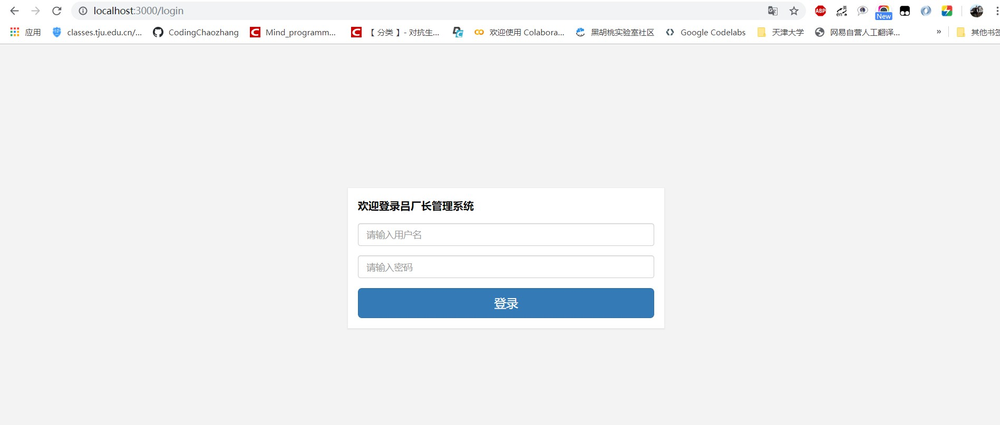

# 【开发篇】10分钟快速上手spring boot+react登录前后端分离

本次将带来前后端分离的spring boot+react的登录demo。




# 一、前后端分离

## 1.1 前后端分离


在前后端不分离的应用模式中，前端页面看到的效果都是由后端控制，由后端渲染页面或重定向，也就是后端需要控制前端的显示，前端与后端耦合度很高。

## 1.2 前后端分离


在前后端分离的应用模式中，后端仅返回前端所需的数据，不再渲染HTML页面，不再控制前端的效果。至于前端用户看到的效果，从后端请求的数据如何加载到前后端中，都有前端自己决定，网页有网页的处理方法，但无论哪种前端，所需的数据基本相同，后端仅需开发一套逻辑对外提供数据即可。

# 二、后端设计

## 2.1 数据库表设计


## 2.2 技术

- spring boot
- mybatis

## 2.3 项目结构


### 1.entity

```java 
package com.lcz.login.entity;

/**
 * @author : codingchao
 * @date : 2020-08-16 14:02
 * @Description:
 **/
public class User {
    private int id;
    private String username;
    private String password;

    public User(String username, String password) {
        this.username = username;
        this.password = password;
    }

    public String getUsername() {
        return username;
    }

    public void setUsername(String username) {
        this.username = username;
    }

    public String getPassword() {
        return password;
    }

    public void setPassword(String password) {
        this.password = password;
    }
}
```


```java
package com.lcz.login.entity;

import java.io.Serializable;
import java.util.HashMap;
import java.util.Map;

/**
 * @author : codingchao
 * @date : 2020-08-16 14:15
 * @Description:
 **/
public class Result<T>  {
    // 错误码
    private Integer code;
    // 提示信息
    private String msg;
    // 具体内容
    private T data;

    public Integer getCode() {
        return code;
    }

    public void setCode(Integer code) {
        this.code = code;
    }

    public String getMsg() {
        return msg;
    }

    public void setMsg(String msg) {
        this.msg = msg;
    }

    public T getData() {
        return data;
    }

    public void setData(T data) {
        this.data = data;
    }
}
```

### 2.mapper

```java
package com.lcz.login.mapper;

/**
 * @author : codingchao
 * @date : 2020-08-16 14:04
 * @Description:
 **/

import com.lcz.login.entity.User;
import org.apache.ibatis.annotations.Mapper;
import org.springframework.stereotype.Repository;

import java.util.List;

@Repository
@Mapper
public interface  UserMapper {
    // 通过账户名来查询密码
    User findUserByName(String username);
}
```

### 3.service

```java
package com.lcz.login.service;

import com.lcz.login.entity.User;
import com.lcz.login.mapper.UserMapper;
import org.springframework.beans.factory.annotation.Autowired;
import org.springframework.stereotype.Service;

import java.util.List;

/**
 * @author : codingchao
 * @date : 2020-08-16 14:07
 * @Description:
 **/
public interface UserSerice {
    public User findUserByName(String name);
}
```

### 4.service/impl

```java 
package com.lcz.login.service.impl;

import com.lcz.login.entity.Result;
import com.lcz.login.entity.User;
import com.lcz.login.mapper.UserMapper;
import com.lcz.login.service.UserSerice;
import org.springframework.beans.factory.annotation.Autowired;
import org.springframework.stereotype.Service;

import java.util.List;

/**
 * @author : codingchao
 * @date : 2020-08-16 14:09
 * @Description:
 **/
@Service
public class UserServiceImpl implements UserSerice {

    @Autowired
    private UserMapper userMapper;

    @Override
    public User findUserByName(String name) {
        User user = userMapper.findUserByName(name);

        return user;
    }
}
```

### 5.controller

```java
package com.lcz.login.controller;

import com.lcz.login.entity.Result;
import com.lcz.login.entity.User;
import com.lcz.login.service.impl.UserServiceImpl;
import org.springframework.beans.factory.annotation.Autowired;
import org.springframework.web.bind.annotation.*;

import java.util.List;

/**
 * @author : codingchao
 * @date : 2020-08-16 14:10
 * @Description:
 **/
@RestController
@RequestMapping(value="/crud",method = {RequestMethod.GET,RequestMethod.POST})
public class UserController {

    @Autowired
    private UserServiceImpl userService;

    @PostMapping("/listUserByName")
    public Result<User> findUserByName(@RequestParam("username")String username,
                                     @RequestParam("password")String password){
        User user = userService.findUserByName(username);
        Result result = new Result();
        if (user.getPassword().equals(password)){
            result.setCode(0);
            result.setMsg("成功");
            result.setData(user);
        }else{
            result.setCode(-1);
            result.setMsg("失败");
            result.setData("");
        }
        return result;
    }
}
```

### 6.resource/mapper/UserMapper.xml

```xml
<?xml version="1.0" encoding="UTF-8"?>
<!DOCTYPE mapper
        PUBLIC "-//mybatis.org//DTD Mapper 3.0//EN"
        "http://mybatis.org/dtd/mybatis-3-mapper.dtd">

<mapper namespace="com.lcz.login.mapper.UserMapper">
    <resultMap id="result" type="com.lcz.login.entity.User">
        <result property="username" column="username"/>
        <result property="password" column="password"/>
    </resultMap>


    <select id="findUserByName" resultMap="result">
        SELECT * FROM user where username=#{username}
    </select>
</mapper>

```

其余的配置，可参考[开发篇]10分钟快速上手spring boot+mybatis增删改查。


# 三、前端设计

前端在一个bootstrap开源框架上进行操作的。

## 3.1 技术

- React
- Bootstrap
- font-awesome


## 3.2 功能实现

登录界面输入账号密码->发送请求到后端进行验证->验证成功进入主页->选择退出账号->回到登录页面

## 3.3 重要技术

### 1.跨域请求

- 前端的端口在localhost:3000
- 后端的端口在localhost:8081

属于跨域请求，本次在前端通过http-proxy-middleware模块来实现跨域请求

在src下新建setupProxy.js

```js
// 跨域请求

const {createProxyMiddleware} = require('http-proxy-middleware');


module.exports = function (app) {

  app.use(createProxyMiddleware('/listUserByName', {target: 'http://localhost:8081/crud/', changeOrigin: true}))

} 
```

### 2.LocalStoage存取

```jsx
//localstorage读取

  setStorage(name,data){

    let dataType = typeof data;
    
    // json
    
    if(dataType === 'object'){
    
      window.localStorage.setItem(name,JSON.stringify(data));
    
    }else if( ['number','string','boolean'].indexOf(dataType) >=0 ){
    
      window.localStorage.setItem(name,data);
    
    }else{
    
      alert("该类型不能用于本地存储");
    
    }

  }


  getStorage(name){

    let data = window.localStorage.getItem(name);
    
    if(data){
    
      return JSON.parse(data);
    
    }else{
    
      return '';
    
    }

  }

  removeStorage(name){

    window.localStorage.removeItem(name);

  }
```


### 3.登录

- 表单验证在前端，看账号和密码是否为空以及是否满足要求
- 回车提交表单请求
- 登录成功之后将用户存入localstorage
- 主页界面读取localstorage的信息并显示用户名

```jsx
request(param) {
        return new Promise((resolve, reject) => {
            $.ajax({
                type: param.type || 'get',
                url: param.url || '',
                dataType: param.dataType || 'json',
                data: param.data || null,
                success: res => {
                    resolve(res);
                },
                error: err => {
                    resolve(err);
                }
            })
        })
    }
```


```jsx
    onSubmit = () => {
        let loginInfo = {
            username: this.state.username,
            password: this.state.password,
            redirect : '/'
        };
    // 表单验证
    let checkResult = _mm.checkLoginInfo(loginInfo);

    // console.log(checkResult);
    if (checkResult.status) {
        _mm.request({
            type : 'post',
            url: '/listUserByName',
            data:{
                username: this.state.username,
                password: this.state.password
            }
        }).then((res) => {
            if(res.code==-1){
                _mm.errorTips("账号密码错误");
            }else if(res.code==0){
                _mm.setStorage('userInfo',res);
                this.props.history.push(this.state.redirect);
            }
           
        }, (errMsg) => {
            console.log(errMsg);
        })
    } else {
        _mm.errorTips(checkResult.msg);
    }
}
```
### 4.退出

- 点击退出，删除localstorage中的信息
- 游览器获得不到localstorage信息，则进入登录界面

```jsx
// 这是退出登录
    onLogout = () => {
        _mm.removeStorage('userInfo');
        window.location.href = ("/login");
    }
    // 验证是否有登录信息
    componentWillMount(){
        if(_mm.getStorage("userInfo") == ''){
            window.location.href = ("/login");
        }
    }
```

