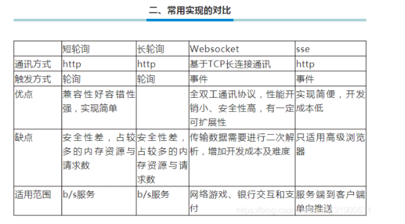
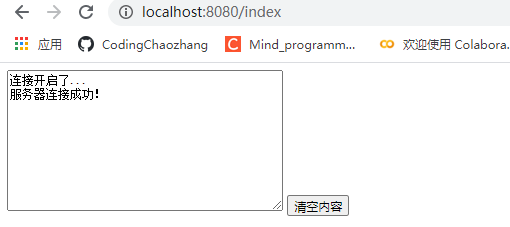
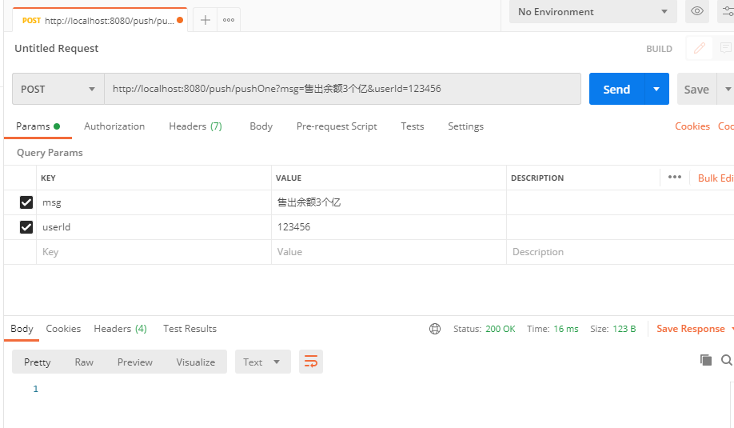
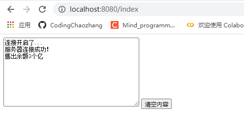

# SpringBoot + WebSocket + Netty实现消息推送

# 一、基础知识

Websocket是一种在单个TCP连接上进行全双工通信的协议。Websocket使得客户端和服务器之间的数据交换变得更加简单，允许服务端主动向客户端推送数据。在WebSocket API中，游览器和服务器只需要完成一次握手，两者之间就直接可以创建持久性的连接，并进行双向数据传输。而且websocket支持很多种数据传输，如二进制流、文本、文本信息等。



Netty是基于JavaNIO再次封装的一个处理的异步的，事件驱动的网络应用程序的框架和工具。

其与Tomcat最大的区别在于通信协议，tomcat是基于http协议的，tomcat的实质上是基于http协议的web容器；但netty不一样，它能通过编程自定义各种协议，因为netty能够通过codec自己来编码/解码字节流了。

> [Web实时通信技术即消息推送机制- 简要介绍短连接 长连接 轮询 长轮询 SSE WebSocket？](https://codingchaozhang.blog.csdn.net/article/details/110097515)
>
> [【面试篇】Java中BIO、NIO、AIO的区别是什么？](https://codingchaozhang.blog.csdn.net/article/details/110295513)
>
> [Java网络编程-netty](https://codingchaozhang.blog.csdn.net/article/details/110451454)

# 二、实现过程

消息推送功能：可以满足给所有用户推送，也可以满足给指定某个用户推送消息。

思路：

- 前端使用websocket与服务器端创建连接，将用户ID传给服务器端；
- 服务器端将用户ID与channel关联起来存储，同时将channel放入到channel组中；
- 如果需要给所有用户发送消息，直接执行channel组的writeAndFlush()方法；
- 如果需要给指定用户发送消息，根据用户ID查询到对应的channel，然后执行writeAndFlush()方法；
- 前端获取到服务器端推送的消息之后，将消息内容展示到文本域中。

## 2.1 pom.xml依赖

```xml
 <!--支持thymeleaf-->
        <dependency>
            <groupId>org.springframework.boot</groupId>
            <artifactId>spring-boot-starter-thymeleaf</artifactId>
        </dependency>

        <dependency>
            <groupId>io.netty</groupId>
            <artifactId>netty-all</artifactId>
            <version>4.1.33.Final</version>
        </dependency>

        <dependency>
            <groupId>cn.hutool</groupId>
            <artifactId>hutool-all</artifactId>
            <version>5.2.3</version>
        </dependency>
```

## 2.2 application.yml

```yml
server:
  port: 8080

spring:
  thymeleaf:
    cache: false
    mode: HTML5
    prefix: classpath:/templates/  #默认 classpath:/templates/
    suffix: .html
    servlet:
      content-type: text/html

```

## 2.3 创建NetConfig

在NettyConfig中定义一个channel组，管理所有的channel，再定义一个map，管理用户与channel的对应关系。

```java
package com.lcz.springboot_netty_websocket.config;

import io.netty.channel.Channel;
import io.netty.channel.group.ChannelGroup;
import io.netty.channel.group.DefaultChannelGroup;
import io.netty.util.concurrent.GlobalEventExecutor;

import java.util.concurrent.ConcurrentHashMap;

/**
 * 在nettyconfig中定义一个channel组，管理所有的channel。
 * 再定义一个map，管理用户与channel的对应关系
 */
public class NettyConfig {

    // 定义一个channel组，管理所有的channel
    // GlobalEventExecutor.INSTANCE 是全局的事件执行器，是一个单例
    private static ChannelGroup channelGroup = new DefaultChannelGroup(GlobalEventExecutor.INSTANCE);

    // 存放用户与channel的对应信息，用于给指定用户发送消息
    private static ConcurrentHashMap<String, Channel> userChannelMap = new ConcurrentHashMap<>();

    private NettyConfig(){

    }

    /**
     * 获取channel组
     * @return
     */
    public static ChannelGroup getChannelGroup(){
        return channelGroup;
    }

    public static ConcurrentHashMap<String,Channel> getUserChannelMap(){
        return userChannelMap;
    }

}

```

## 2.4 创建Netty的初始化类NettyServer

创建NettyServer，定义两个EventLoopGroup，bossGroup辅助客户端的tcp连接请求, workGroup负责与客户端之前的读写操作，需要说明的是，需要开启一个新的线程来执行netty server，要不然会阻塞主线程，到时候就无法调用项目的其他controller接口了。

```java
package com.lcz.springboot_netty_websocket.server;

import io.netty.bootstrap.ServerBootstrap;
import io.netty.channel.ChannelFuture;
import io.netty.channel.ChannelInitializer;
import io.netty.channel.EventLoopGroup;
import io.netty.channel.nio.NioEventLoopGroup;
import io.netty.channel.socket.SocketChannel;
import io.netty.channel.socket.nio.NioServerSocketChannel;
import io.netty.handler.codec.http.HttpObjectAggregator;
import io.netty.handler.codec.http.HttpServerCodec;
import io.netty.handler.codec.http.websocketx.WebSocketServerProtocolHandler;
import io.netty.handler.codec.serialization.ObjectEncoder;
import io.netty.handler.stream.ChunkedWriteHandler;
import org.slf4j.Logger;
import org.slf4j.LoggerFactory;
import org.springframework.beans.factory.annotation.Autowired;
import org.springframework.beans.factory.annotation.Value;
import org.springframework.stereotype.Component;

import javax.annotation.PostConstruct;
import javax.annotation.PreDestroy;
import java.net.InetSocketAddress;

/**
 * NettyServer，定义了两个EventLoopGroup
 */
@Component
public class NettyServer{
    private static final Logger log = LoggerFactory.getLogger(NettyServer.class);
    /**
     * webSocket协议名
     */
    private static final String WEBSOCKET_PROTOCOL = "WebSocket";

    /**
     * 端口号
     */
    @Value("${webSocket.netty.port:58080}")
    private int port;

    /**
     * webSocket路径
     */
    @Value("${webSocket.netty.path:/webSocket}")
    private String webSocketPath;

    @Autowired
    private WebSocketHandler webSocketHandler;

    private EventLoopGroup bossGroup;
    private EventLoopGroup workGroup;

    /**
     * 启动
     * @throws InterruptedException
     */
    private void start() throws InterruptedException {
        bossGroup = new NioEventLoopGroup();
        workGroup = new NioEventLoopGroup();
        ServerBootstrap bootstrap = new ServerBootstrap();
        // bossGroup辅助客户端的tcp连接请求, workGroup负责与客户端之前的读写操作
        bootstrap.group(bossGroup,workGroup);
        // 设置NIO类型的channel
        bootstrap.channel(NioServerSocketChannel.class);
        // 设置监听端口
        bootstrap.localAddress(new InetSocketAddress(port));
        // 连接到达时会创建一个通道
        bootstrap.childHandler(new ChannelInitializer<SocketChannel>() {

            @Override
            protected void initChannel(SocketChannel ch) throws Exception {
                // 流水线管理通道中的处理程序（Handler），用来处理业务
                // webSocket协议本身是基于http协议的，所以这边也要使用http编解码器
                ch.pipeline().addLast(new HttpServerCodec());
                ch.pipeline().addLast(new ObjectEncoder());
                // 以块的方式来写的处理器
                ch.pipeline().addLast(new ChunkedWriteHandler());
        /*
        说明：
        1、http数据在传输过程中是分段的，HttpObjectAggregator可以将多个段聚合
        2、这就是为什么，当浏览器发送大量数据时，就会发送多次http请求
         */
                ch.pipeline().addLast(new HttpObjectAggregator(8192));
        /*
        说明：
        1、对应webSocket，它的数据是以帧（frame）的形式传递
        2、浏览器请求时 ws://localhost:58080/xxx 表示请求的uri
        3、核心功能是将http协议升级为ws协议，保持长连接
        */
                ch.pipeline().addLast(new WebSocketServerProtocolHandler(webSocketPath, WEBSOCKET_PROTOCOL, true, 65536 * 10));
                // 自定义的handler，处理业务逻辑
                ch.pipeline().addLast(webSocketHandler);

            }
        });
        // 配置完成，开始绑定server，通过调用sync同步方法阻塞直到绑定成功
        ChannelFuture channelFuture = bootstrap.bind().sync();
        log.info("Server started and listen on:{}",channelFuture.channel().localAddress());
        // 对关闭通道进行监听
        channelFuture.channel().closeFuture().sync();
    }

    /**
     * 释放资源
     * @throws InterruptedException
     */
    @PreDestroy
    public void destroy() throws InterruptedException {
        if(bossGroup != null){
            bossGroup.shutdownGracefully().sync();
        }
        if(workGroup != null){
            workGroup.shutdownGracefully().sync();
        }
    }
    @PostConstruct()
    public void init() {
        //需要开启一个新的线程来执行netty server 服务器
        new Thread(() -> {
            try {
                start();
            } catch (InterruptedException e) {
                e.printStackTrace();
            }
        }).start();
    }
}


```

## 2.5 创建Netty配置的操作执行类WebSocketHandler

具体实现业务的WebSocketHandler。

```java
package com.lcz.springboot_netty_websocket.server;


import cn.hutool.json.JSONObject;
import cn.hutool.json.JSONUtil;
import com.lcz.springboot_netty_websocket.config.NettyConfig;
import io.netty.channel.ChannelHandler;
import io.netty.channel.ChannelHandlerContext;
import io.netty.channel.SimpleChannelInboundHandler;
import io.netty.handler.codec.http.websocketx.TextWebSocketFrame;
import io.netty.util.AttributeKey;
import org.slf4j.Logger;
import org.slf4j.LoggerFactory;
import org.springframework.stereotype.Component;


/**
 * TextWebSocketFrame类型， 表示一个文本帧
 * @author sixiaojie
 * @date 2020-03-28-13:47
 */
@Component
@ChannelHandler.Sharable
public class WebSocketHandler extends SimpleChannelInboundHandler<TextWebSocketFrame> {
    private static final Logger log = LoggerFactory.getLogger(NettyServer.class);

    /**
     * 一旦连接，第一个被执行
     * @param ctx
     * @throws Exception
     */
    @Override
    public void handlerAdded(ChannelHandlerContext ctx) throws Exception {
        log.info("handlerAdded 被调用"+ctx.channel().id().asLongText());
        // 添加到channelGroup 通道组
        NettyConfig.getChannelGroup().add(ctx.channel());
    }

    /**
     * 读取数据
     */
    @Override
    protected void channelRead0(ChannelHandlerContext ctx, TextWebSocketFrame msg) throws Exception {
        log.info("服务器收到消息：{}",msg.text());

        // 获取用户ID,关联channel
        JSONObject jsonObject = JSONUtil.parseObj(msg.text());
        String uid = jsonObject.getStr("uid");
        NettyConfig.getUserChannelMap().put(uid,ctx.channel());

        // 将用户ID作为自定义属性加入到channel中，方便随时channel中获取用户ID
        AttributeKey<String> key = AttributeKey.valueOf("userId");
        ctx.channel().attr(key).setIfAbsent(uid);

        // 回复消息
        ctx.channel().writeAndFlush(new TextWebSocketFrame("服务器连接成功！"));
    }

    @Override
    public void handlerRemoved(ChannelHandlerContext ctx) throws Exception {
        log.info("handlerRemoved 被调用"+ctx.channel().id().asLongText());
        // 删除通道
        NettyConfig.getChannelGroup().remove(ctx.channel());
        removeUserId(ctx);
    }

    @Override
    public void exceptionCaught(ChannelHandlerContext ctx, Throwable cause) throws Exception {
        log.info("异常：{}",cause.getMessage());
        // 删除通道
        NettyConfig.getChannelGroup().remove(ctx.channel());
        removeUserId(ctx);
        ctx.close();
    }

    /**
     * 删除用户与channel的对应关系
     * @param ctx
     */
    private void removeUserId(ChannelHandlerContext ctx){
        AttributeKey<String> key = AttributeKey.valueOf("userId");
        String userId = ctx.channel().attr(key).get();
        NettyConfig.getUserChannelMap().remove(userId);
    }
}


```

## 2.6 推送信息接口PushService

```java
package com.lcz.springboot_netty_websocket.server;

public interface PushService {
    /**
     * 推送给指定用户
     * @param userId
     * @param msg
     */
    void pushMsgToOne(String userId,String msg);

    /**
     * 推送给所有用户
     * @param msg
     */
    void pushMsgToAll(String msg);
}

```

## 2.7 推送信息接口实现类PushServiceImpl

另外一个是PushServiceImpl.

```java
package com.lcz.springboot_netty_websocket.server;

import com.lcz.springboot_netty_websocket.config.NettyConfig;
import io.netty.channel.Channel;
import io.netty.handler.codec.http.websocketx.TextWebSocketFrame;
import org.springframework.stereotype.Service;

import java.util.concurrent.ConcurrentHashMap;

/**
 * @author sixiaojie
 * @date 2020-03-30-20:10
 */
@Service
public class PushServiceImpl implements PushService {

    @Override
    public void pushMsgToOne(String userId, String msg){
        ConcurrentHashMap<String, Channel> userChannelMap = NettyConfig.getUserChannelMap();
        Channel channel = userChannelMap.get(userId);
        channel.writeAndFlush(new TextWebSocketFrame(msg));
    }
    @Override
    public void pushMsgToAll(String msg){
        NettyConfig.getChannelGroup().writeAndFlush(new TextWebSocketFrame(msg));
    }
}

```

## 2.8 提供服务的PushController

```java
package com.lcz.springboot_netty_websocket.controller;


import com.lcz.springboot_netty_websocket.server.PushService;
import org.springframework.beans.factory.annotation.Autowired;
import org.springframework.web.bind.annotation.PostMapping;
import org.springframework.web.bind.annotation.RequestMapping;
import org.springframework.web.bind.annotation.RequestParam;
import org.springframework.web.bind.annotation.RestController;

/**
 * @author sixiaojie
 * @date 2020-03-30-20:08
 */
@RestController
@RequestMapping("/push")
public class PushController {

    @Autowired
    private PushService pushService;

    /**
     * 推送给所有用户
     * @param msg
     */
    @PostMapping("/pushAll")
    public void pushToAll(@RequestParam("msg") String msg){
        pushService.pushMsgToAll(msg);
    }
    /**
     * 推送给指定用户
     * @param userId
     * @param msg
     */
    @PostMapping("/pushOne")
    public void pushMsgToOne(@RequestParam("userId") String userId,@RequestParam("msg") String msg){
        pushService.pushMsgToOne(userId,msg);
    }
}
```

## 2.9 前端页面通过websocket与后端连接

```html
<!DOCTYPE html>
<html lang="en">
<head>
    <meta charset="UTF-8">
    <title>Title</title>
</head>
<body>
<script>
    var socket;
    // 判断当前浏览器是否支持webSocket
    if(window.WebSocket){
        socket = new WebSocket("ws://172.23.167.22:58080/webSocket")
        // 相当于channel的read事件，ev 收到服务器回送的消息
        socket.onmessage = function (ev) {
            var rt = document.getElementById("responseText");
            rt.value = rt.value + "\n" + ev.data;
        }
        // 相当于连接开启
        socket.onopen = function (ev) {
            var rt = document.getElementById("responseText");
            rt.value = "连接开启了..."
            socket.send(
                JSON.stringify({
                    // 连接成功将，用户ID传给服务端
                    uid: "123456"
                })
            );
        }
        // 相当于连接关闭
        socket.onclose = function (ev) {
            var rt = document.getElementById("responseText");
            rt.value = rt.value + "\n" + "连接关闭了...";
        }
    }else{
        alert("当前浏览器不支持webSocket")
    }


</script>
<form onsubmit="return false">
    <textarea id="responseText" style="height: 150px; width: 300px;"></textarea>
    <input type="button" value="清空内容" onclick="document.getElementById('responseText').value=''">
</form>
</body>
</html>
```

# 三、具体效果

初步连接



后台通过postman模拟更新请求



前台对消息进行响应更新

