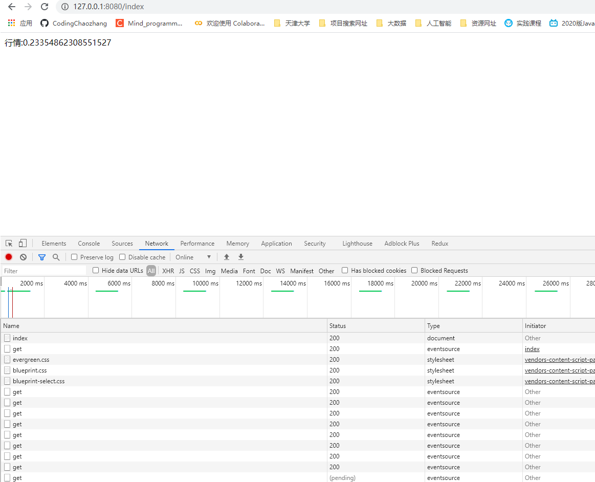
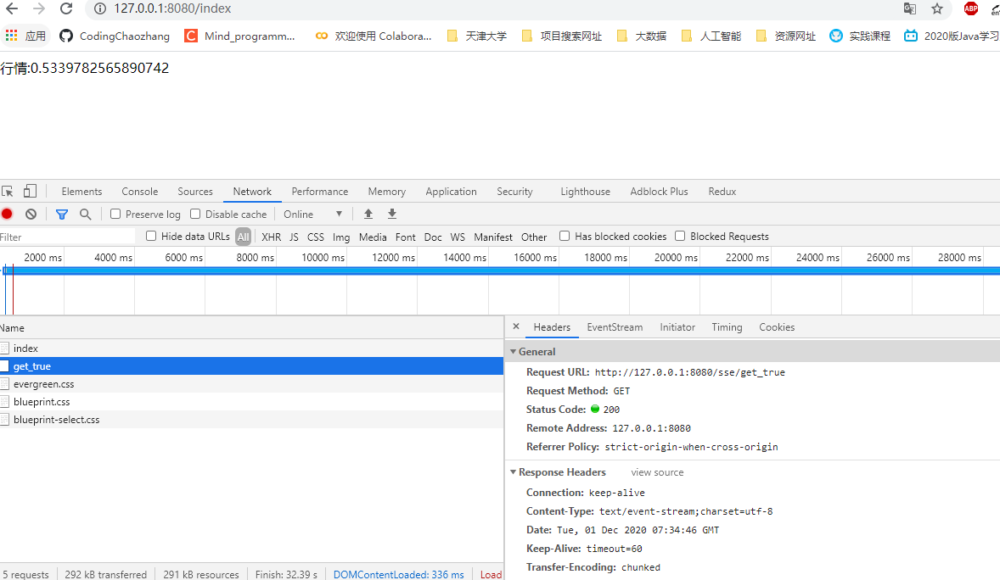

# Spring boot整合SSE实现服务器实时推送流信息

SSE全程`Server Sent Event`，就是服务器发送事件。本文将在springboot的基础上实现一个sse，实现服务器实时推流。

# 一、SSE相关知识

**SSE的基本特性：**

- HTML5中的协议，是基于纯文本的简单协议；
- 在游览器端可供JavaScript使用的EventSource对象

EventSource提供了三个标准事件，同时默认支持断线重连

| 事件      | 描述                         |
| --------- | ---------------------------- |
| onopen    | 当成功与服务器建立连接时产生 |
| onmessage | 当收到服务器发来的消息时发生 |
| onerror   | 当出现错误时发生             |

> 传输的数据有格式上的要求，必须为 [data:...\n...\n]或者是[retry:10\n]

**简单使用demo：**

EventSource 对象用于接收服务器发送事件通知：

```js
var source=new EventSource("demo_sse.php");
source.onmessage=function(event)
{
    document.getElementById("result").innerHTML+=event.data + "<br>";
};
```

实例解析：

- 创建一个新的 EventSource 对象，然后规定发送更新的页面的 URL（本例中是 "demo_sse.php"）
- 每接收到一次更新，就会发生 onmessage 事件
- 当 onmessage 事件发生时，把已接收的数据推入 id 为 "result" 的元素中


具体相关知识可见[Web实时通信技术即消息推送机制- 简要介绍短连接 长连接 轮询 长轮询 SSE WebSocket？](https://codingchaozhang.blog.csdn.net/article/details/110097515)


# 二、Spring Boot整合SSE实现服务器推流

## 2.1 搭建前端页面

首先需要在spring boot的基础上的搭建出前端页面，使用呢thymeleaf，具体可参考[spring boot整合thymeleaf,支持JSP和HTML页面开发](https://codingchaozhang.blog.csdn.net/article/details/110431490)

本节的SSE页面代码如下：

```html
<!DOCTYPE html>
<html lang="en">
<head>
    <meta charset="UTF-8">
    <title>Spring boot整合SSE实现服务器推送流信息</title>
    <script>
        if(typeof(EventSource)!=="undefined")
        {
            var source = new EventSource("/sse/get");
            source.onmessage = function(event)
            {
                // document.getElementById("result").innerHTML+=event.data + "<br>";
                document.getElementById('result').innerText = event.data ;
            };
        }
        else
        {
            document.getElementById("result").innerHTML="抱歉，你的浏览器不支持 server-sent 事件...";
        }
    </script>
</head>
<body>
    <div id="result"></div>
</body>
</html>
```

游览器发送了一个/sse/get请求。接下来在controller下写相关请求。

## 2.2 搭建后端Controller

```java
@RestController
@RequestMapping("/sse")
public class SSEController {
    /**
     * 网上的方法 但存在一个问题 运行在tomcat中，tomcat会帮助直接给关掉，而sse有自动重连，所以每次都会重新发起请求。
     * @return
     */
    @GetMapping(value = "get",produces = "text/event-stream;charset=UTF-8")
    public String getData(){
        try {
            Thread.sleep(1000);
        } catch (InterruptedException e) {
            e.printStackTrace();
        }
        return "data:行情:" + Math.random()+"\n\n";
    }
}

```

具体效果如下



但该方法，我们可以发现前端还是在不断的发送请求，不是像SSE说的那样，该种实现方式还是存在着一些问题的。


对上述的controller方法进行改进，并将前文的html的请求进行替换，改进如下：

```java
    @GetMapping(value = "get_true")
    public void getData_True(HttpServletResponse response){
        response.setContentType("text/event-stream");
        response.setCharacterEncoding("utf-8");

        try{
            PrintWriter pw = response.getWriter();
            while (true){
                if (pw.checkError()){
                    System.out.println("客户端断开连接");
                    break;
                }
                Thread.sleep(1000);
                pw.write("data:行情:" + Math.random()+"\n\n");
                pw.flush();
            }
        }catch (IOException | InterruptedException e){
            e.printStackTrace();
        }
    }
```


结果如下，只通过一个请求，便实现了更新：

