# spring boot同时支持JSP和HTML


# 一、创建一个spring boot的web程序

首先通过IDEA快速建立一个spring boot的应用。

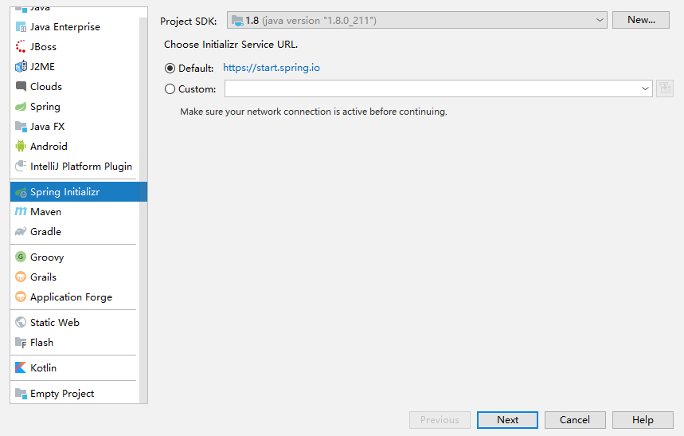

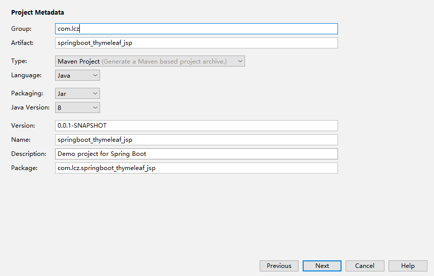

选择好spring web所需的模块。

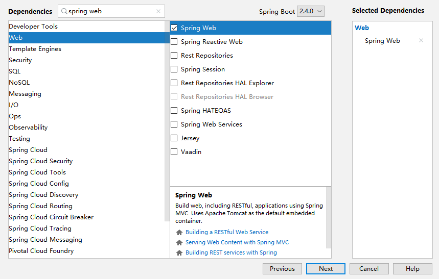

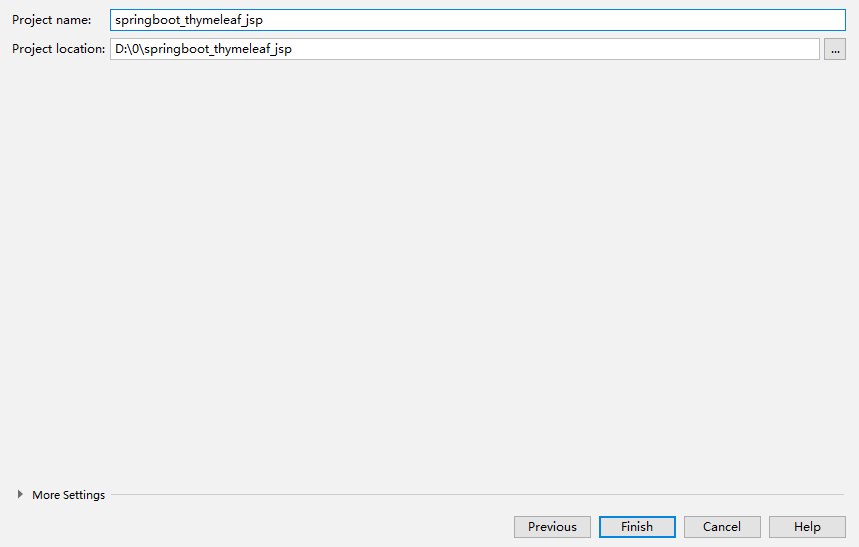

之后在java下新建一个controller，新建一个hellocontroller.java文件，之后测试一下，在游览器打开localhost:8080/hello。

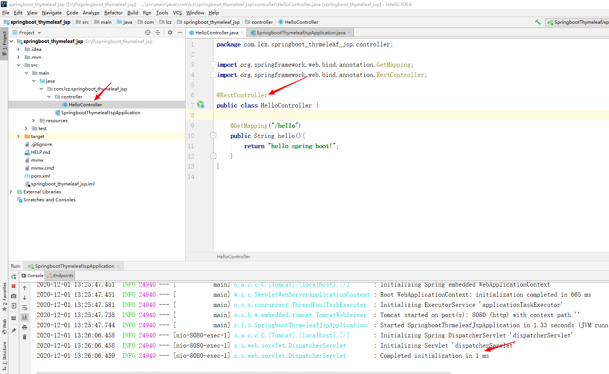

```java
@RestController
public class HelloController {

    @GetMapping("/hello")
    public String hello(){
        return "hello spring boot!";
    }
}

```

出现下图则代表spring boot搭建正常。


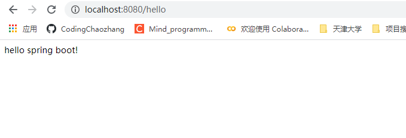

# 二、spring boot支持thymeleaf

thymeleadf是支持html的，那么如何操作呢？

## 2.1 pom.xml

在pom.xml中添加依赖包

```xml
<!--支持thymeleaf-->
<dependency>
    <groupId>org.springframework.boot</groupId>
    <artifactId>spring-boot-starter-thymeleaf</artifactId>
</dependency>
```

## 2.2 application.yml

对spring boot新建的application.properties文件重命名为application.yml文件，之后添加thymeleaf配置。这里将thymeleaf默认扫描的位置更改了。需在main/webapp/WEB-INF新建。

```yml
server:
  port: 8080

spring:
  thymeleaf:
    cache: true
    mode: LEGACYHTML5  #非严格模式
      prefix: /WEB-INF/ #默认 classpath:/templates/
      suffix: .html
      servlet:
        content-type: text/html
```

## 2.3 新建一个webapp目录

新建的目录结构如图所示

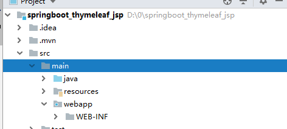、


之后在IDEA下的File，选择Project structure选项


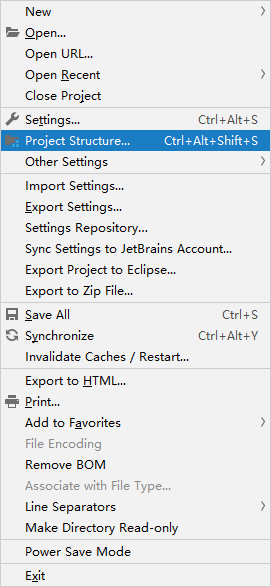

之后选择modules->web，出现如下所示界面。

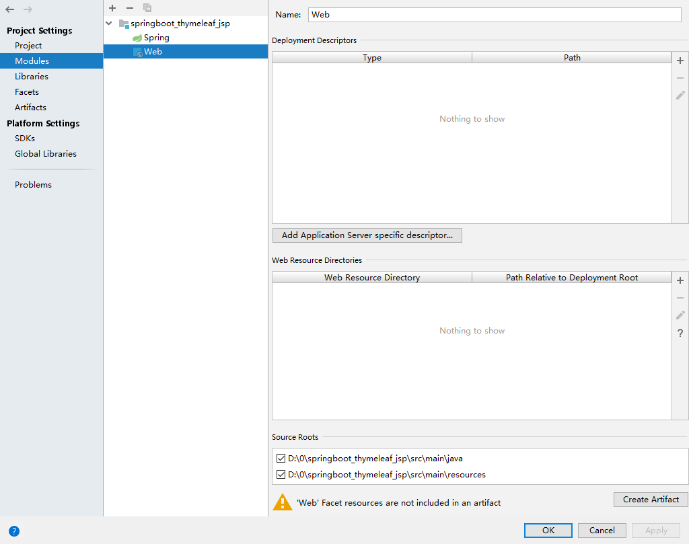

之后对其添加webapp目录

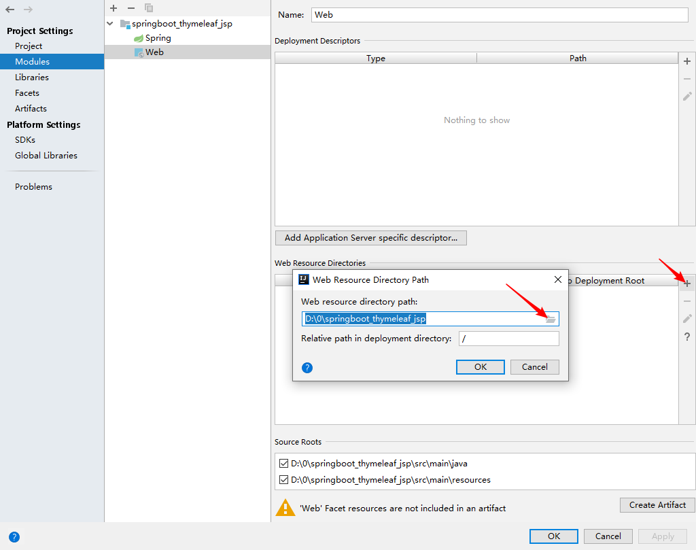

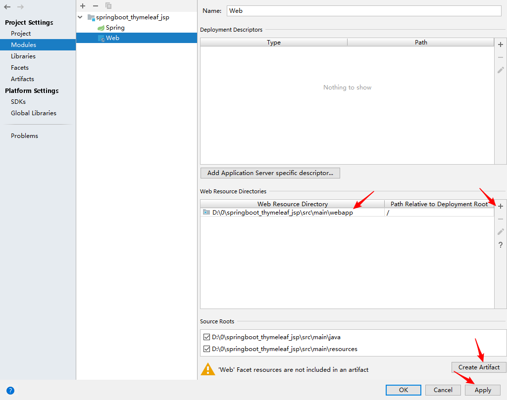

点击create artifact之后出现的界面，ok即完成。

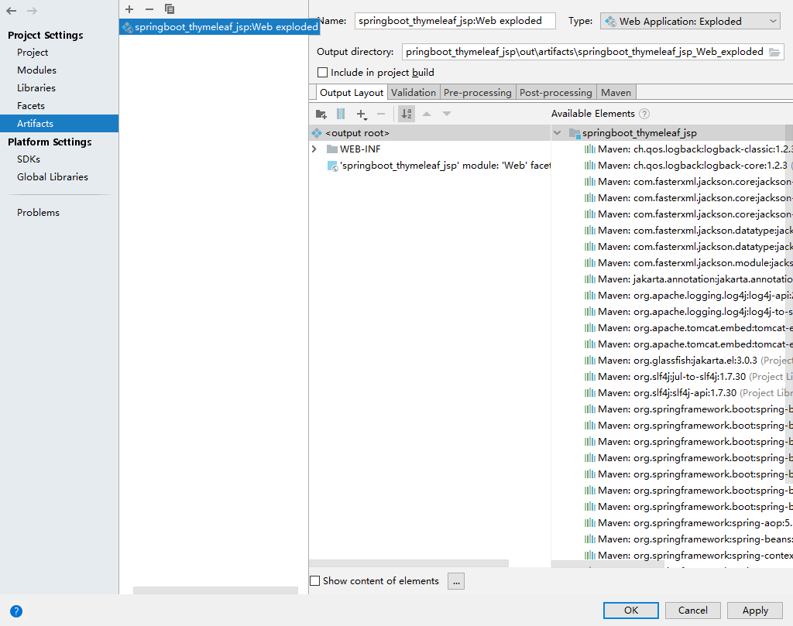

## 2.4 webapp/WEB-INF/show.html

在WEB-INF下新建一个show.html的文件，内容如下所示

```html
<!DOCTYPE HTML>
<html xmlns:th="http://www.thymeleaf.org">
<head>
    <title>SpringBoot模版渲染</title>
    <meta http-equiv="Content-Type" content="text/html;charset=UTF-8"/>
</head>
<body>
<p th:text="'用户名称：' + ${name}"/>
</body>
</html>
```

## 2.5 Thymeleaf_JSP_Controller

在controller下新建thymeleaf_jsp_controller文件，如下所示：

```java
package com.lcz.springboot_thymeleaf_jsp.controller;

import org.slf4j.Logger;
import org.slf4j.LoggerFactory;
import org.springframework.stereotype.Controller;
import org.springframework.ui.Model;
import org.springframework.web.bind.annotation.GetMapping;

import javax.servlet.http.HttpServletRequest;
import javax.servlet.http.HttpServletResponse;

@Controller
public class Thymelead_JSP_Controller {
    private static Logger logger = LoggerFactory.getLogger(Thymelead_JSP_Controller.class);

    @GetMapping("/show")
    public String show(Model model, HttpServletRequest request, HttpServletResponse response){
        model.addAttribute("name","HTML");
        return "show";
    }
}

```

> **注意：** 在controller层这里使用的@Controller注解，而不是@RestController注解。
>
> RestController = Controller + ResponseBody.使用@RestController,返回的内容是你return中的内容，如果是return “Hello World”，页面显示的就是Hello World。使用@Controller，返回的是return中对应的页面,比如return “hello”,页面的名称是hello。

出现如下所示，即成功完成thymeleaf的搭建操作。

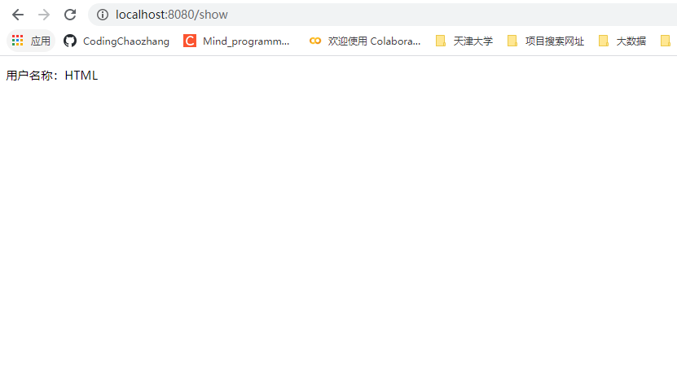

# 三、spring boot支持jsp

在上述的基础上，使其支持jsp页面的开发。

## 3.1 pom.xml

在pom.xml中添加依赖，使其支持jsp的开发

```xml
<!--tomcat支持-->
<dependency>
    <groupId>org.springframework.boot</groupId>
    <artifactId>spring-boot-starter-tomcat</artifactId>
    <scope>provided</scope>
</dependency>
<dependency>
    <groupId>org.apache.tomcat.embed</groupId>
    <artifactId>tomcat-embed-jasper</artifactId>
    <scope>provided</scope>
</dependency>
<!--servlet依赖.-->
<dependency>
    <groupId>javax.servlet</groupId>
    <artifactId>javax.servlet-api</artifactId>
    <version>4.0.1</version>
    <scope>provided</scope>
</dependency>
<!--jsp标签库-->
<dependency>
    <groupId>javax.servlet</groupId>
    <artifactId>jstl</artifactId>
</dependency>
```

## 3.2 application.yml

在application.yml添加配置，整体配置如下

```yml
server:
  port: 8080

spring:
  mvc:
    view:
      prefix: /WEB-INF/
      suffix: .jsp
  thymeleaf:
    cache: false
    mode: LEGACYHTML5  #非严格模式
    prefix: /WEB-INF/ #默认 classpath:/templates/
    suffix: .html
    servlet:
      content-type: text/html

```

## 3.3 webapp/WEB-INF/show-jsp.jsp

show-jsp.jsp的代码如下所示：

```java
<%@ page contentType="text/html;charset=UTF-8" isELIgnored="false" pageEncoding="UTF-8" %>
<%@ taglib uri="http://java.sun.com/jstl/core_rt" prefix="c" %>
<!DOCTYPE html >
<html lang="zh-CN">
<head>
    <meta http-equiv="Content-Type" content="text/html; charset=utf-8"/>
</head>
<body>
<input type="text" name="name" value=${name} />
</body>

<script type="text/javascript" charset="utf-8">

</script>
</html>
```

## 3.4 Thymeleaf_JSP_Controller

在Thymeleaf_JSP_Controller中添加另外一个的controller的请求。不同于之前的请求，用request来转发至页面。具体代码如下所示：

```java
package com.lcz.springboot_thymeleaf_jsp.controller;

import org.slf4j.Logger;
import org.slf4j.LoggerFactory;
import org.springframework.stereotype.Controller;
import org.springframework.ui.Model;
import org.springframework.web.bind.annotation.GetMapping;

import javax.servlet.ServletException;
import javax.servlet.http.HttpServletRequest;
import javax.servlet.http.HttpServletResponse;
import java.io.IOException;

@Controller
public class Thymelead_JSP_Controller {
    private static Logger logger = LoggerFactory.getLogger(Thymelead_JSP_Controller.class);

    @GetMapping("/show")
    public String show(Model model, HttpServletRequest request, HttpServletResponse response){
        model.addAttribute("name","HTML");
        return "show";
    }

    @GetMapping("/show_jsp")
    public void show_jsp(Model model, HttpServletRequest request, HttpServletResponse response) throws ServletException, IOException {
        model.addAttribute("name","name");
        request.setAttribute("name","JSP");
        request.getRequestDispatcher("/WEB-INF/show_jsp.jsp").forward(request, response);
    }
}
```

出现以下界面，则表示搭建完成！！！

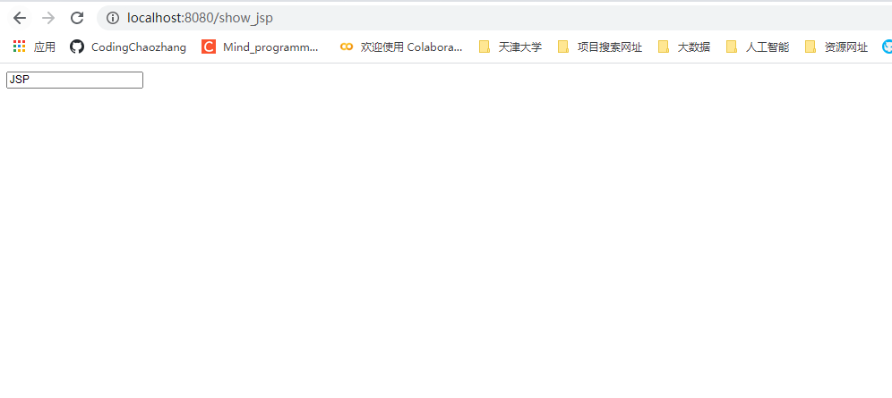
